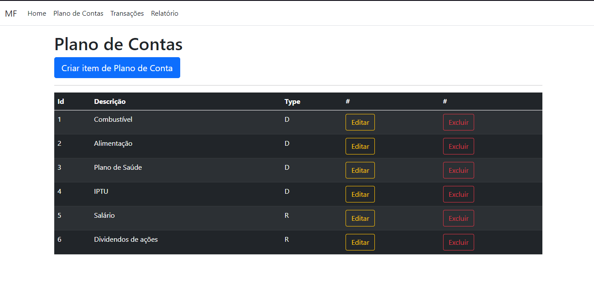

# MF - My Finance

O projeto MyFinance, desenvolvido como parte do Curso de Pós-Graduação em Engenharia da Computação na PUC-MG, tem como objetivo fornecer uma solução de controle financeiro pessoal para seus usuários. Com sua interface amigável e intuitiva, o software ajuda os usuários a medir, rastrear e controlar suas finanças de forma eficaz.

O controle financeiro pessoal é essencial para garantir a saúde financeira a curto e longo prazo e para alcançar objetivos financeiros de longo prazo, como economizar para uma casa ou uma aposentadoria confortável. Com o MyFinance, os usuários podem gerenciar suas despesas e receitas, definir orçamentos, criar metas financeiras e acompanhar seu progresso ao longo do tempo.

## Tecnologias

O projeto utiliza as tecnologias:

- ASP .NET MVC
- SQL Server
- Bootstrap

## Banco de dados

Para o projeto utilizamos o banco de dados relacional SQL Server, seguindo a modelagem de dados apresentada:

- O banco de dados através se encontra no script: (myfinance-web-netcore\database\myfynance.sql)

## Como rodar o projeto

Para executar o projeto: 
- Na pasta myfinance-web-netcore/src via terminal CMD, executar o comando `dotnet run`.
É necessário possuir instalado a última versão do Visual Studio Code juntamente com a versão 6.0 em diante do SDK.net.

## Funcionalidades

## Criar Despesas

Nessa aba, o usuário pode inserir ou remover contas conforme sua necessidade.

## Transações

Todas as transações são exibidas em forma de lista e podem ser filtradas através da ferramenta disposta na parte superior da guia, bem como o relatório por período.

## Gráfico

Ao final da exibição do relatório, o usuário pode acessar o gráfico para checar a relação entre receitas e despesas.
